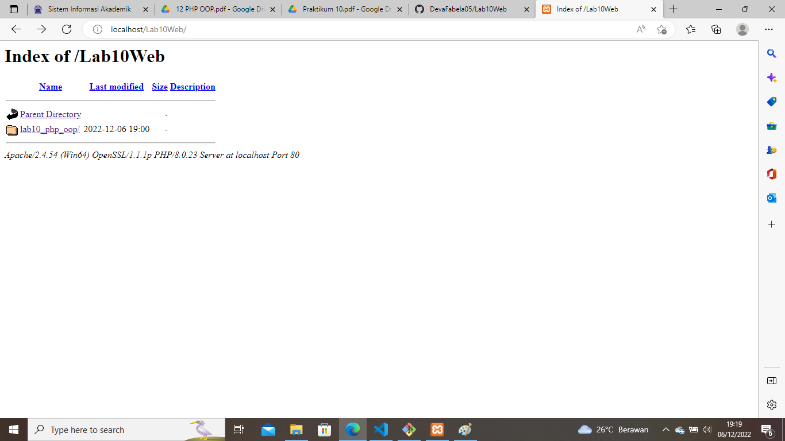
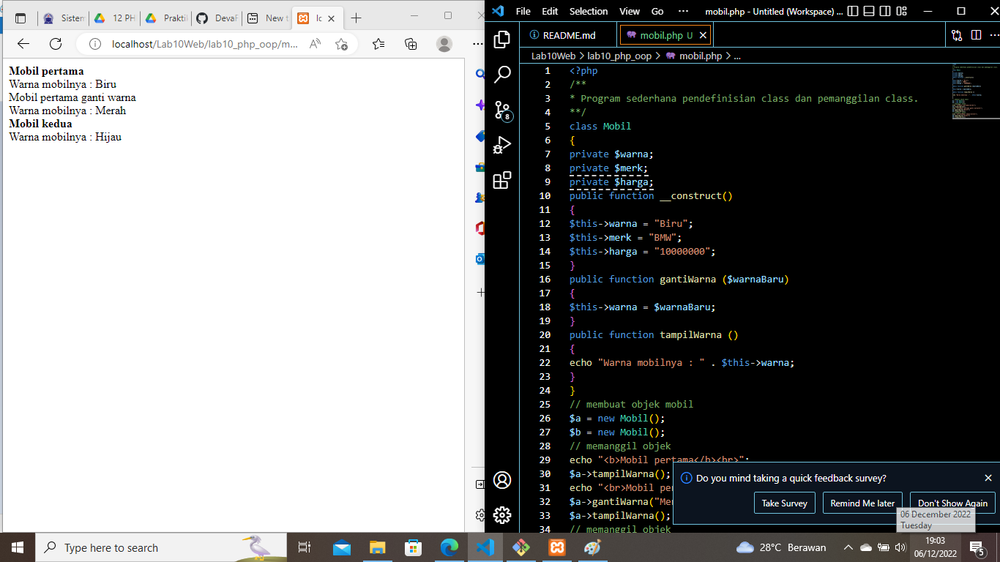
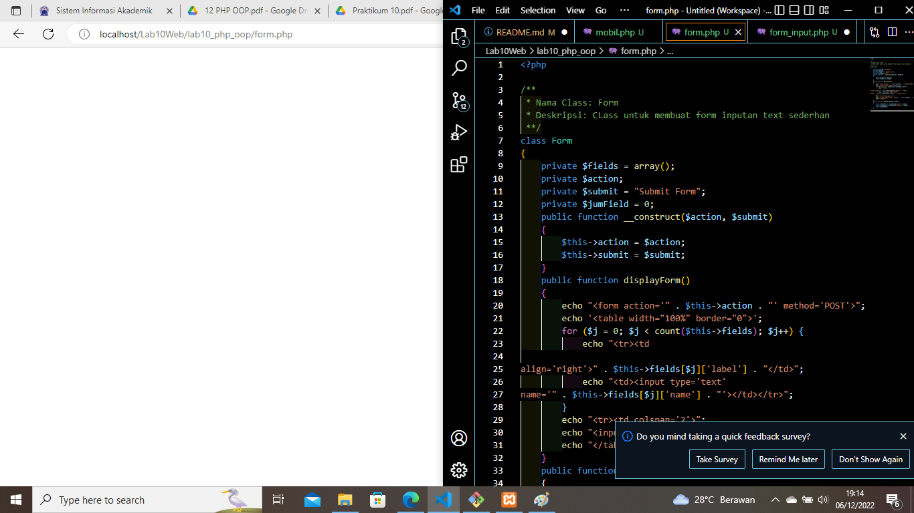
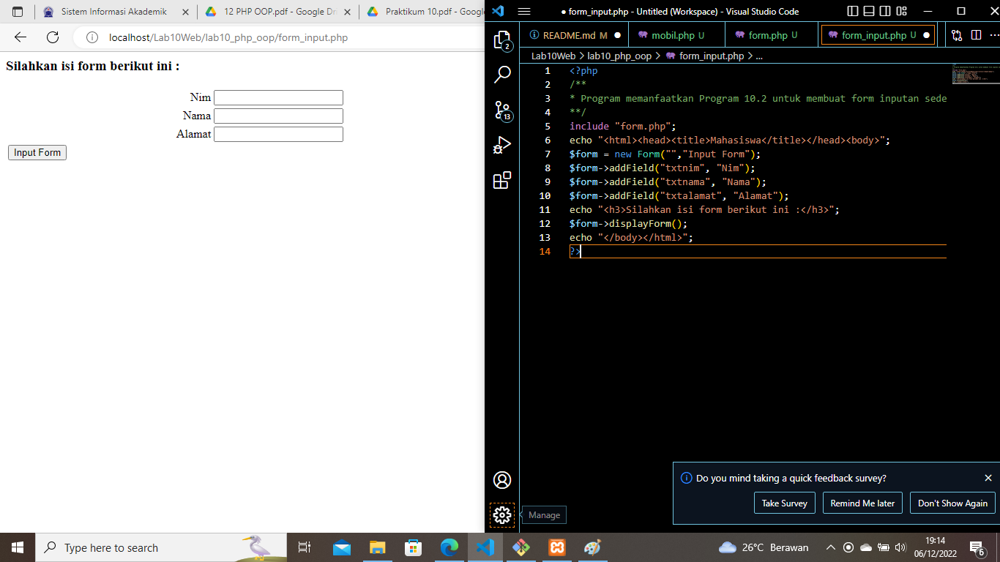

# Lab10Web

## PHP OOP

### Langkah - langkah Pratikum 10

#### membuat folder lab10_php_oop

Dengan mengaktifkan xampp terlebih dahulu untuk menyalakan aphace dan mysql, lalu kemudian membuat folder baru dengan nama lab10_php_oop pada root directory web server (c:\xampp\htdocs). dan bisa di cek melalui http://localhost/lab10_php_oop/ pada google chrome maupun mozila. Beginilah tampilannya:

#### Membuat File mobil.php

Dengan membuat file mobil.php yang menapilkan keterangan. Inilah tampilannya:

#### Membuat File class

kemudian membuat file class, sebagai wadah script yang digunakan sebagai cetakan untuk membuat objek. Inilah tampilannya:

#### Hasil pratikum 10

dengam membuat file baru dengan nama form.php yang memangil file class. Inilah tampilanya:

